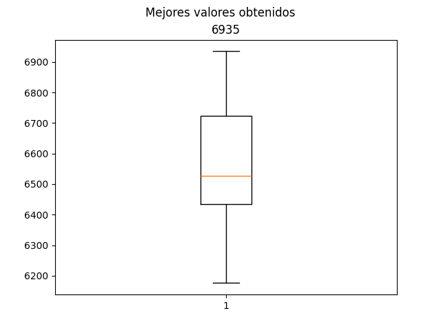

# Knapsack problem BPSO

En este repositorio se encuentran la implementación de un PSO binario para la resolución del problema combinatorio de la mochila.

# Gráfica de caja y brazos



El resultado de nuestra implementación con los valores y pesos especificados nos dieron como resultado la gráfica de caja y brazos para observar la distribución. Podemos observar un valor máximo de 6,935 con los siguientes valores especificados.

```python

# Datos del problema de la mochila
    valores = [
        # Valores de los elementos
        360, 83, 59, 130, 431, 67, 230, 52, 93, 125, 670, 892, 600, 38, 48, 147,
        78, 256, 63, 17, 120, 164, 432, 35, 92, 110, 22, 42, 50, 323, 514, 28,
        87, 73, 78, 15, 26, 78, 210, 36, 85, 189, 274, 43, 33, 10, 19, 389, 276,
        312
    ]

    pesos = [
        # Pesos de los elementos
        7, 3, 30, 22, 80, 94, 11, 81, 70, 64, 59, 18, 13, 36, 3, 8, 15, 42, 9, 12,
        42, 47, 52, 32, 26, 48, 55, 6, 29, 84, 2, 4, 18, 56, 7, 29, 93, 44, 71,
        3, 86, 66, 31, 65, 14, 79, 20, 65, 52, 13
    ]
    peso_mochila = 850

```

También se realizó una iteración de 30 semillas diferentes que van desde 0 hasta 29.

```python

for semilla in range(30):
        # 30 semillas diferentes
        random.seed(semilla)
        np.random.seed(semilla)

        # Ejecución del BPSO
        mejor_posicion, mejor_valor = PSOBinario(valores, pesos, peso_mochila)

        valores_obtenidos.append(mejor_valor)

        # Resultados
        print("Semilla: ", semilla)
        print("La mejor solución encontrada tiene un valor total de:", mejor_valor)
        print("Los elementos seleccionados son:", mejor_posicion)

```
